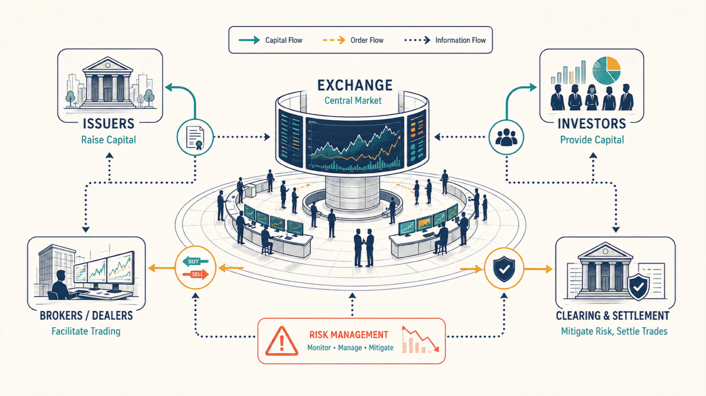
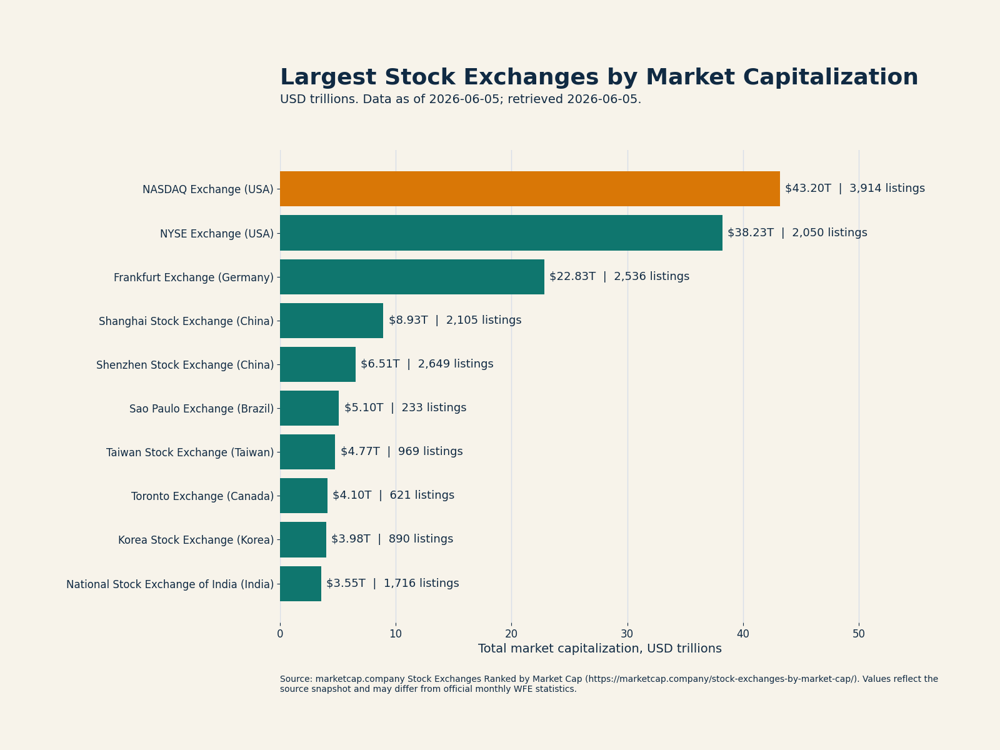
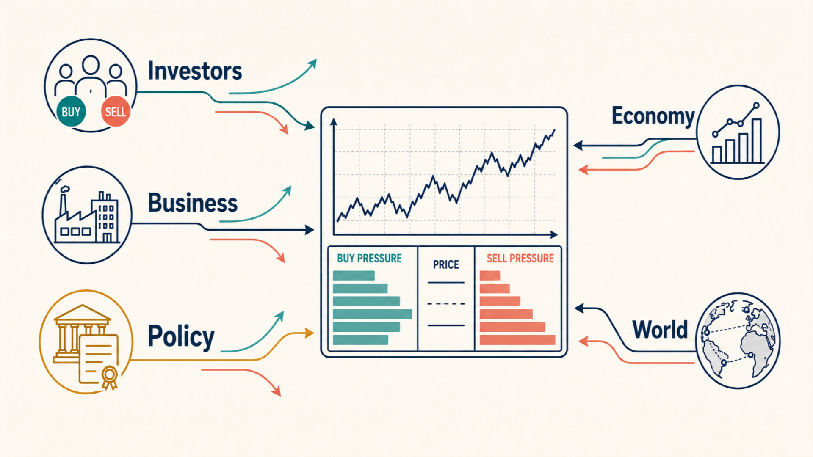

# Market Foundations

Module: Markets and Data

## Lesson summary

This note introduces the market language students need before working with financial datasets. The goal is not to build valuation, portfolio, fixed-income, or derivative-pricing models yet. The goal is to understand what financial markets do, what is traded, how instruments are quoted, why prices change, and how macroeconomic conditions shape market observations {cite}`mishkin2019financial,fabozzi2019foundations`.

Financial data should not be treated as isolated numbers. Prices, yields, spreads, volumes, and returns are observable traces of contracts, institutions, expectations, liquidity, regulation, and risk {cite}`imfFinancialMarkets`.

This lesson answers four practical questions:

1. What is the market?
2. What is traded?
3. How is it quoted?
4. Why do prices change?

## Learning objectives

- Explain the economic function of financial markets.
- Distinguish primary and secondary markets, exchange-traded and OTC markets, and price discovery and valuation.
- Identify the main instruments that appear in market datasets.
- Read basic quotation conventions before calculating returns.
- Connect price changes with expectations, liquidity, risk, interest rates, inflation, exchange rates, growth, and monetary policy.
- Recognize which concepts belong here only as bridges to later modules.

## Setup

No code is required for this reading. Keep a notes table with columns for concept, market example, data field, and modeling implication. The table will be reused in the extraction, EDA, quality, and dashboard notebooks.

## Lesson flow

1. Map the role of markets, participants, venues, and post-trade infrastructure.
2. Compare the main instruments and the data fields needed to analyze them.
3. Read quotation conventions such as price, rate, yield, return, spread, volume, coupon, maturity, and duration.
4. Explain price formation through expectations, supply and demand, discount rates, risk premia, and liquidity.
5. Connect macroeconomic context with market data.



## What financial markets do

Financial markets connect entities that need capital with investors that have capital to allocate. They also support liquidity, price discovery, risk transfer, and capital allocation across the economy {cite}`mishkin2019financial,imfFinancialMarkets`.

The practical implication for data work is direct: a dataset is easier to interpret when the analyst understands the market structure that produced it. A daily equity close, a bond yield, an ETF price, a central bank rate, and a derivatives premium are all market observations, but they come from different contracts, venues, calendars, conventions, and information sets.

## Market structure

### Primary and secondary markets

The **primary market** is where securities are issued for the first time. In this market, the issuer raises capital directly from investors.

The **secondary market** is where existing securities trade among investors after issuance. Secondary markets matter because they provide liquidity, observable prices, and continuous information about how the market values an instrument {cite}`imfFinancialMarkets`.

### Exchange-traded and OTC markets

Financial instruments may trade on organized exchanges or in over-the-counter markets. Exchanges centralize rules, order interaction, and price reporting. OTC markets are usually organized through bilateral dealer relationships and may provide more customization but less public transparency {cite}`imfFinancialMarkets`.

This distinction matters for reproducible analysis. Exchange-traded instruments often have cleaner public histories, while OTC instruments may require specialized vendors, indicative quotes, or model-based valuation.

### Participants and infrastructure

Financial markets include several types of participants:

- **Issuers:** governments, corporations, financial institutions, trusts, and special-purpose vehicles that raise capital.
- **Investors:** individuals, pension funds, mutual funds, insurers, banks, hedge funds, family offices, and other capital allocators.
- **Intermediaries:** brokers, dealers, market makers, banks, and advisory firms that facilitate transactions.
- **Trading venues:** exchanges, electronic platforms, and OTC networks.
- **Post-trade infrastructure:** central securities depositories, clearing houses, central counterparties, custodians, and settlement systems.
- **Regulators and supervisors:** authorities that set rules, monitor conduct, and preserve market integrity.

In Mexico, Indeval provides central securities depository services and supports custody, clearing, and settlement for securities-market instruments {cite}`indevalAbout`. Grupo BMV operates key securities and derivatives-market infrastructure, including exchange services, derivatives markets, clearing houses, valuation services, and risk management services {cite}`grupoBmvAbout`.

Students should be able to distinguish:

- issuer vs. investor;
- broker vs. dealer;
- trading vs. clearing vs. settlement;
- exchange-traded vs. OTC market;
- price discovery vs. valuation.



## Financial instruments

A financial instrument is a contract or security that represents economic rights. It may represent ownership, debt, participation in a portfolio, exposure to real estate, participation in long-term projects, or a derivative payoff based on an underlying variable {cite}`fabozzi2019foundations,hull2022options`.

The purpose here is not to price every instrument in depth. The purpose is to understand what each instrument represents, how it is quoted, how it can generate returns, and what risks should be recognized before analyzing its data.

| Instrument | Economic meaning | Common return source | Main introductory risk | Typical data fields |
| --- | --- | --- | --- | --- |
| Equity | Ownership in a company | Price appreciation and dividends | Business and market risk | Ticker, date, open, high, low, close, adjusted close, volume, dividends, splits |
| Fixed income | Loan to an issuer | Coupons, price changes, reinvestment, inflation adjustment | Interest-rate, credit, reinvestment, and inflation risk | Issuer, maturity, coupon, clean price, dirty price, yield, duration, rating, spread |
| Mutual fund | Managed pooled portfolio | Portfolio income and appreciation | Market, manager, fee, and liquidity risk | Net asset value, holdings, benchmark, fees, assets under management, distributions |
| ETF | Exchange-traded pooled portfolio | Basket or index return | Market, liquidity, tracking, and premium/discount risk | Ticker, market price, NAV, holdings, benchmark, volume, expense ratio |
| FIBRA | Listed Mexican real estate vehicle | Distributions and real estate appreciation | Real estate, occupancy, leverage, rate, and liquidity risk | Certificate price, distributions, occupancy, NOI, leverage, property type |
| CKD | Trust vehicle for projects or companies | Project cash flows, distributions, asset exits | Illiquidity, project, governance, execution, and valuation risk | Trust identifier, manager, sector, capital calls, distributions, NAV, project progress |
| Derivative | Contract linked to an underlying asset, rate, index, currency, or commodity | Payoff structure or change in underlying | Leverage, margin, counterparty, liquidity, model, and basis risk | Underlying, contract code, expiration, strike, premium, futures price, implied volatility, margin, open interest |

Equities represent ownership and may provide capital appreciation, dividends, and voting rights depending on the security {cite}`investorGovStocks`. Fixed-income instruments represent debt claims; in Mexico, federal government securities include CETES, Bonos, Bondes, and Udibonos {cite}`investorGovBonds,banxicoGovSecurities`. Funds and ETFs pool investor money, while ETFs also trade intraday on exchanges {cite}`investorGovFunds,secMutualFundsEtfs`. FIBRAs and CKDs introduce listed real estate and long-horizon project-finance vehicles in the Mexican market {cite}`bmvFibras,bmvCkds`. Derivatives link their value to an underlying variable and are used for hedging, speculation, arbitrage, and exposure management {cite}`hull2022options,cmeFuturesIntro`.

The bridge to later modules is important. Duration, convexity, yield-curve modeling, derivative pricing, option Greeks, implied volatility, beta, tracking error, and VaR should not be developed fully here. In this module they are introduced only so students can recognize the fields and avoid misreading datasets.

## Quotation, liquidity, and market conventions

Different instruments are quoted in different ways. A stock may be quoted as a price per share, a bond as a price, yield, or spread, a currency as an exchange rate, a derivative as a contract price or premium, and a fund as a net asset value or market price.

### Price, rate, yield, and return

**Price** is the amount at which an asset can be bought or sold. For listed instruments, common fields include open, high, low, close, adjusted close, last price, and volume-weighted average price.

**Rate** usually expresses the cost of money or interest over a period. **Yield** usually expresses the return implied by price and expected cash flows, especially in fixed income. **Return** measures the realized or calculated gain or loss relative to an initial value.

In fixed income, bond prices and yields generally move in opposite directions. When market yields rise, existing bond prices tend to fall; when market yields fall, existing bond prices tend to rise.

### Bid, ask, spread, volume, and liquidity

The **bid** is the price at which a participant is willing to buy. The **ask** is the price at which a participant is willing to sell. The **bid-ask spread** is an implicit transaction cost because a buyer usually pays the ask and a seller usually receives the bid.

**Volume** measures how much traded during a period. **Liquidity** describes the ability to trade without causing a large price movement. More liquid instruments usually have tighter spreads, deeper order books, higher trading volume, and more continuous price discovery {cite}`imfFinancialMarkets`.

### Fixed-income conventions

For fixed-income instruments, **face value** is the reference principal amount, **coupon** is the periodic interest payment, **maturity** is the date principal is due, and **duration** is an introductory measure of interest-rate sensitivity. Bond datasets may also distinguish **clean price**, which excludes accrued interest, from **dirty price**, which includes it.

This module introduces those conventions only to prevent data interpretation errors. Detailed bond pricing belongs in the fixed-income modules.

### Calendars and frequencies

Financial datasets often combine instruments with different trading calendars, time zones, holidays, publication lags, and observation frequencies. Daily equity prices, weekly fund values, monthly inflation, central bank rates, and quarterly financial statements cannot be merged mechanically without explicit alignment rules.

This issue becomes central in the data notebooks, where students clean, align, and validate data before analysis.

## Price formation



A market price is not the same as intrinsic value. Market price is observable; value is estimated. The observed price reflects the interaction of buyers and sellers under changing expectations, information, liquidity, risk preferences, and constraints {cite}`damodaran2012investment`.

### Price discovery and expectations

Price discovery is the process through which market participants incorporate available information, expectations, and trading interest into observable prices {cite}`imfFinancialMarkets`.

Markets often react not only to a reported number but to the difference between the reported number and what investors expected. Inflation may fall and still disappoint markets if it falls less than expected. A company may report profits and still decline if profits are below consensus expectations.

### Supply, demand, and risk premia

Prices tend to rise when buying pressure exceeds selling pressure and tend to fall when selling pressure exceeds buying pressure. In financial markets, supply and demand are shaped by expectations about earnings, interest rates, inflation, exchange rates, credit conditions, regulation, liquidity, and risk appetite.

Investors generally require compensation for bearing risk. Higher uncertainty, weaker liquidity, higher credit risk, or longer horizons may require higher expected returns. When required expected return rises, the current price may need to fall to make the investment attractive.

### Discount rates and cash flows

Many financial assets can be understood as claims on expected future cash flows discounted at a rate that reflects time value, inflation, risk, and opportunity cost {cite}`damodaran2012investment`.

When discount rates rise, the present value of distant cash flows usually falls. This is one reason changes in interest rates can affect bonds, equities, real estate vehicles, and derivatives.

### Price vs. value

Price is observed in the market. Value is estimated through assumptions about cash flows, risk, discount rates, growth, and liquidity. An asset can have a high price and still be undervalued if expected cash flows and risk justify that price. An asset can have a low price and still be overvalued if its fundamentals are weak.

## Macroeconomic context

Financial prices are affected by expected cash flows, discount rates, and perceived risk. Macroeconomic variables influence all three. Interest rates, inflation, exchange rates, growth, and monetary policy therefore provide essential context for market analysis {cite}`mishkin2019financial`.

### Interest rates and monetary policy

Interest rates represent the price of money over time. They affect borrowing costs, saving incentives, fixed-income yields, equity valuation, real estate vehicles, exchange rates, and derivative pricing. Banco de Mexico states that its main objective is to maintain low and stable inflation, and it uses the target for the overnight interbank interest rate as an operational reference for monetary policy implementation {cite}`banxicoCentralBank,banxicoOperatingTarget`.

Higher interest rates may reduce the present value of future cash flows, increase financing costs, pressure long-duration assets, and make short-term fixed-income instruments more attractive. Lower interest rates may support borrowing, raise present values, and encourage investors to seek returns in riskier assets.

### Inflation

Inflation reduces purchasing power and affects nominal rates, real returns, central bank policy, currency expectations, wages, input costs, and valuation. Markets may react strongly when inflation differs from expectations because that difference can change the expected path of interest rates and real returns.

### Exchange rates

An exchange rate is the price of one currency in terms of another. Exchange rates affect import costs, export revenues, foreign-currency debt, international portfolio returns, inflation transmission, and cross-border capital flows.

For Mexico, the peso-dollar exchange rate is especially relevant because it connects domestic markets with trade, investment flows, inflation pressures, and global risk appetite.

### Growth

Economic growth affects sales, earnings, employment, credit quality, tax revenues, investment demand, and risk appetite. Stronger growth can support equities and credit quality, but it may also create inflation pressure if demand exceeds productive capacity. Weaker growth can pressure earnings and credit conditions, but it may also lead to expectations of lower interest rates.

### Macro questions for market analysis

Before interpreting a market dataset, ask:

- Are interest rates rising, falling, or stable?
- Is inflation above or below target?
- Is the exchange rate stable or under pressure?
- Is growth accelerating or slowing?
- Is monetary policy restrictive or accommodative?
- Are risk premiums expanding or compressing?

## Scope boundaries for later modules

| Topic introduced here | Later module where it should be developed |
| --- | --- |
| VaR | Market risk |
| Beta | Portfolio theory and asset pricing |
| Tracking error | Portfolio management |
| Duration, yield to maturity, and convexity | Fixed income |
| Derivatives, option Greeks, and implied volatility | Derivatives |
| Forecasting | Financial time series |
| Valuation | Equity valuation and corporate finance |
| Complex dashboards | Advanced visualization and applications |

## Transition to financial data

This lesson leaves the student with a compact map:

```text
Markets create the structure.
Instruments define what is traded.
Conventions explain how data is quoted.
Price formation explains why prices move.
Macroeconomics explains the environment in which prices move.
```

The next part of the module moves from concepts to data sources, extraction, storage, caching, data quality, return calculation, panel construction, and the reproducible Mexican market pipeline.

## Further reading

This introductory reading consolidates financial-market institution references, public investor education sources, Mexican market infrastructure references, and standard texts in investments, financial markets, fixed income, and derivatives {cite}`mishkin2019financial,fabozzi2019foundations,hull2022options,imfFinancialMarkets`.
