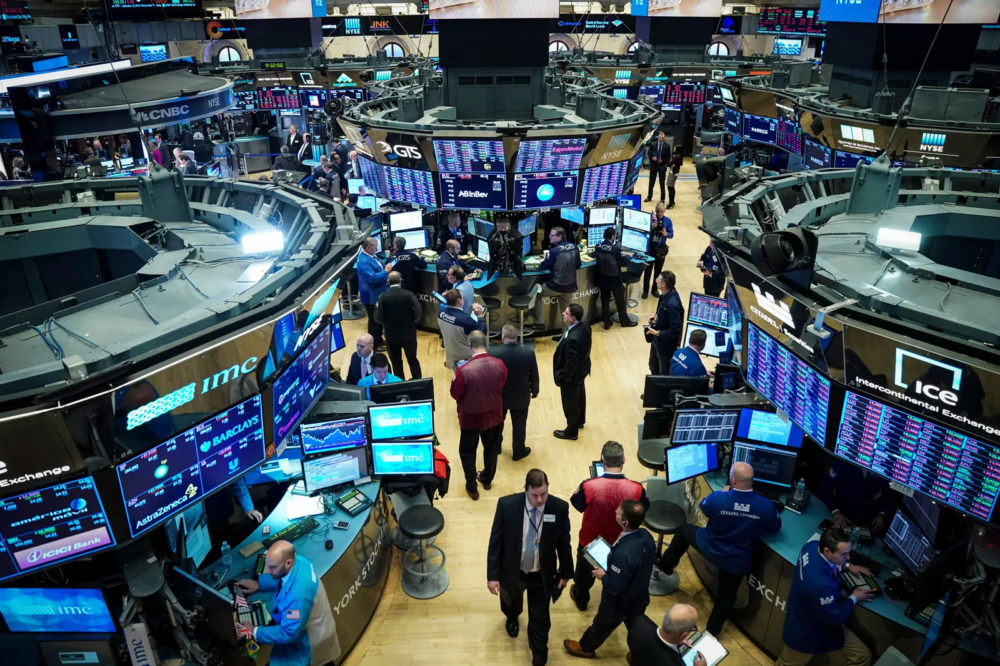
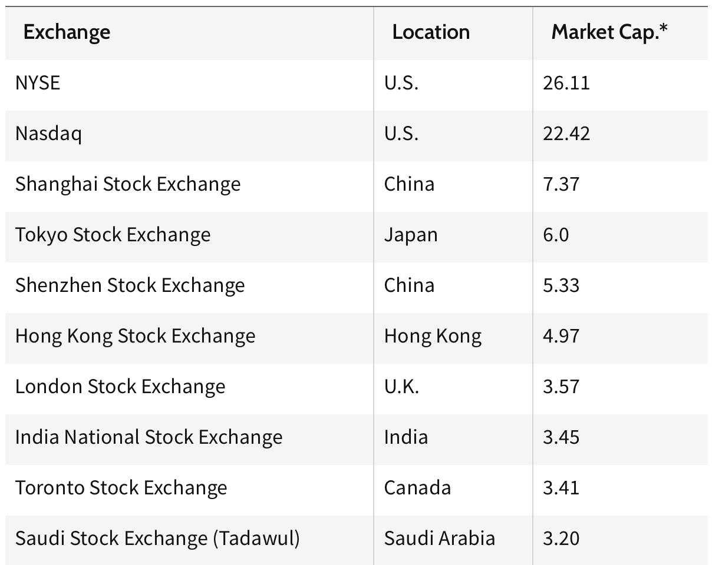
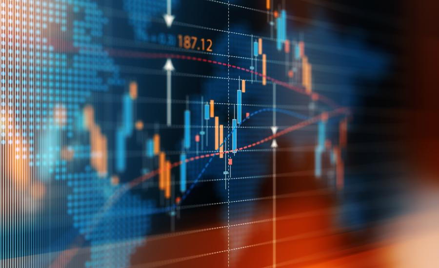

# Operation of the stock markets

## How Does the Stock Market Work?

The stock market helps companies raise money to fund operations by selling shares of stock, and it creates and sustains wealth for individual investors.

Companies raise money on the stock market by selling ownership stakes to investors. These equity stakes are known as shares of stock. By listing shares for sale on the stock exchanges that make up the stock market, companies get access to the capital they need to operate and expand their businesses without having to take on debt. In exchange for the privilege of selling stock to the public, companies are required to disclose information and give shareholders a say in how their businesses are run.

Investors benefit by exchanging their money for shares on the stock market. As companies put that money to work growing and expanding their businesses, investors reap the benefits as their shares of stock become more valuable over time, leading to capital gains. In addition, companies pay dividends to their shareholders as their profits grow.

## How Investment Takes Place

A financial market is a place where firms and individuals enter into contracts to sell or buy a specific product such as a stock, bond, or futures contract. Buyers seek to buy at the lowest available price and sellers seek to sell at the highest available price. There are a number of different kinds of financial markets, depending on what you want to buy or sell, but all financial markets employ professional people and are regulated.

If you want a loan or a savings account you would go to the bank or credit union, if you want to buy stock, a mutual fund or a bond you go to a securities market. The purpose of a securities market is primarily for business to acquire investment capital.

## Stock Markets

Stock markets grew out of small meetings of people who wanted to buy and sell their stocks. These men realized it was much easier to make trades if they were all in the same place at the same time. Today people from all over the world use stock markets to buy and sell shares in thousands of different companies.

New issues of stock in general must be registered with the regulator. A prospectus, giving details about a company's operation and the stock to be issued is printed and distributed to interested parties. Investment bankers buy large quantities of the stock from the company and then resell the stock on an exchange.

A potential buyer places an order with a broker for the stock he or she wishes to purchase. The broker then puts in the order to buy on the appropriate exchange, the transaction takes place when someone wants to sell and someone wants to purchase the stock at the same price. When you purchase a stock, you receive a stock certificate, the certificate may be transferred from one owner to another or can be held by the broker on behalf of the investor.

Stocks, bonds, and futures contracts can also be sold in groups as mutual funds. Mutual funds employ professional managers to make decisions about what to buy and sell.

### Stock Market vs Stock Exchange

Although the terms are used interchangeably, the stock market is not the same as a stock exchange. Think of a stock exchange as a part of a whole—the stock market comprises many stock exchanges, such as the Nasdaq or New York Stock Exchange (NYSE) in the U.S.

When people talk about how the stock market is performing, they mean the thousands of public companies listed on multiple stock exchanges. And more generally, the stock market can be thought of as encompassing a very broad universe of bonds, mutual funds, exchange-traded funds (ETFs) and other securities beyond just stocks.

### Top ten of Stock Exchanges by Market Capitalization

### What Is a Stock Market Index?

A stock market index tracks the performance of a group of stocks that represents a particular industry or segment of the stock market, like the technology, energy and transportation sectors. Often, one of three large indexes is used as shorthand to describe the performance of the U.S. stock market as a whole:

- Dow Jones Industrial Average (DJIA). The DJIA is made up of 30 blue-chip stocks of U.S. industrial companies.
- NYSE Composite Index. The NYSE Composite Index tracks the price movements of all common stocks listed on the New York Stock Exchange.
- S&P 500. The S&P 500 represents 500 of the largest companies in the U.S. economy.

### Function and purpose

The stock market is one of the most important ways for companies to raise money, along with debt markets which are generally more imposing but do not trade publicly. This allows businesses to be publicly traded, and raise additional financial capital for expansion by selling shares of ownership of the company in a public market. The liquidity that an exchange affords the investors enables their holders to quickly and easily sell securities. This is an attractive feature of investing in stocks, compared to other less liquid investments such as property and other immoveable assets.

History has shown that the price of stocks and other assets is an important part of the dynamics of economic activity, and can influence or be an indicator of social mood. An economy where the stock market is on the rise is considered to be an up-and-coming economy. The stock market is often considered the primary indicator of a country's economic strength and development.

Rising share prices, for instance, tend to be associated with increased business investment and vice versa. Share prices also affect the wealth of households and their consumption. Therefore, central banks tend to keep an eye on the control and behavior of the stock market and, in general, on the smooth operation of financial system functions. Financial stability is the raison d'être of central banks.

## Other Markets

- Bond Markets
- Money Markets
- Derivatives Markets
- Forex Market
- Commodities Markets
- Cryptocurrency Markets

## Prices in Markets

### Things That Effect Prices And Markets

Most everyone has heard of the stock market crash that lead to the depression. Many people remember recent stock market drops that occurred in 1989 and in 1997. What makes the markets rapidly fall, when hundreds of stock prices fall at once? What makes the market strong and causes stock prices to rise? Few investors can consistently predict the ups and downs of the market or of an individual investment. But investors who are aware of the factors that affect market price are more likely to make sound investment decisions.

### Factors Which Affect Markets

- Actions of investors: Individual, institutional and mutual fund investors all affect the prices of stocks, bonds, and futures, by their actions. For example, if a large number of people want to buy a certain stock its price will go up, just as if many people were bidding on an item at an auction.

- Business conditions: Both the condition of an individual business and the strength of the industry it is in will effect the price of its stock. Profits earned, volume of sales, and even the time of year will all affect how much an investor wants to own a stock.

- Government actions: The government makes all kinds of decisions that affect both how much an individual stock may be worth (new regulations on a business) and what sort of instruments people want to be investing in. The governments interest rates, tax rates, trade policy and budget deficits all have an impact on prices.

- Economic Indicators: General trends that signal changes in the economy are watched closely by investors to predict what is going to happen next. Indicators include the Gross National Product (how much production is going on in the country), the inflation rate (how quickly prices are rising), the budget deficit (how much the government is spending) and the unemployment rate. These indicators point to changes in the way ordinary people spend their money and how the economy is likely to perform.

- International events: Events around the world, such as changes in currency values, trade barriers, wars, natural disasters, and changes in governments, all change how people think about the value of different investments and about how they should invest in the future.

Today, investments can be purchased around the clock. When the market opens in New York, the Tokyo market has just closed and the London market is half way through its trading day. When prices on one market change all other markets are effected.

## References

- <https://corporatefinanceinstitute.com/resources/capital-markets/stock-market/>
- <https://ag.ny.gov/consumer_frauds/how-financial-markets-work>
- <https://www.forbes.com/advisor/investing/what-is-the-stock-market/>
- <https://en.wikipedia.org/wiki/Stock_market>
